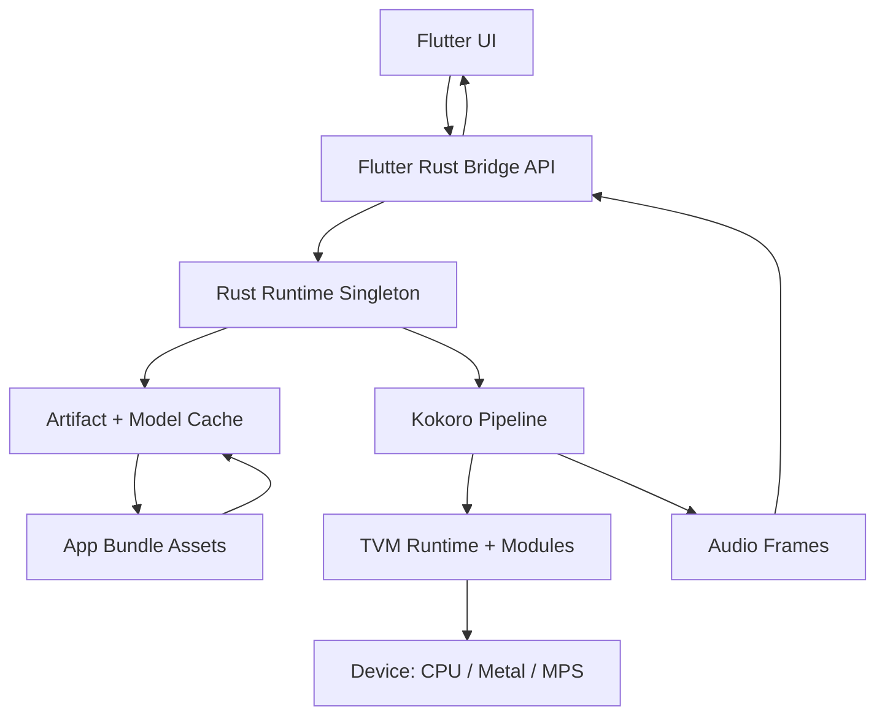

# Flutter + Rust Bridge Runtime Plan

## Goals
- Avoid reloading TVM modules on every call.
- Keep Rust as the long-lived inference service.
- Keep Flutter/Dart API simple and safe for async usage.
- Support iOS/Android bundling of compiled artifacts.

## Lifecycle Overview
- App launch: Flutter initializes a Rust singleton service once.
- First use: Rust loads compiled artifacts, builds the pipeline, warms up.
- Subsequent calls: Reuse the in-memory pipeline and cached assets.
- App background/foreground: Keep in memory when possible; allow explicit teardown.

## Mermaid System Diagram


## Key Components
- Flutter UI: collects text input and plays audio.
- Flutter Rust Bridge API: async methods that call into Rust.
- Rust Runtime Singleton: owns the pipeline, caches, and device config.
- Artifact Cache: resolves and memoizes bundle paths and module handles.
- Pipeline: wraps TVM calls and preprocessing/postprocessing.

## Proposed Rust API (Flutter Rust Bridge)
| Method | Purpose | Notes |
| --- | --- | --- |
| `init(config)` | Create singleton, set device, artifact root, and cache. | Call once at startup. |
| `synthesize(text, voice_id, speed)` | Run inference and return audio bytes or f32 frames. | Non-blocking; uses cached pipeline. |
| `warmup()` | Optional warmup pass to compile kernels and allocate buffers. | Run after init on startup. |
| `status()` | Return runtime status and configuration paths. | Helpful for diagnostics. |
| `shutdown()` | Release pipeline and caches. | Optional for memory pressure. |
| `set_device(device)` | Switch device or rebuild pipeline. | Likely requires re-init. |

## Suggested Runtime Strategy
- Use a `static` or `OnceCell` to hold a `RuntimeState` struct:
  - `pipeline: KokoroPipeline`
  - `device: DeviceConfig`
  - `artifact_dir: PathBuf`
  - `vocab/voice caches` if applicable
- Provide a `Mutex` or `RwLock` around the runtime state.
- Accept a `config` object from Dart with:
  - device string (`cpu`, `metal`)
  - artifacts root path (bundle resource dir)
  - optional warmup flag
- Expose a `synthesize` call that:
  - ensures runtime is initialized
  - uses cached pipeline
  - returns audio (Vec<f32> or PCM i16)

## Artifact Handling (App Bundles)
- Flutter provides an assets path; Rust resolves to:
  - app bundle resource root
  - `tvm_output` subdir fallback
  - `Contents/Resources` for macOS-style bundles
- Use `KokoroPipeline::load_from_artifacts_dir` to find artifacts.
- Cache resolved directory in memory.

## Performance Considerations
- Loading artifacts is expensive; do it once on init.
- Use warmup to avoid first-call latency spikes.
- Keep `KokoroPipeline` alive across calls; avoid rebuilds.
- Use a bounded thread pool if doing multiple inference calls in parallel.

## Error Handling
- Return structured error types to Dart with:
  - reason (missing artifacts, invalid device, TVM error)
  - actionable hint (expected paths or device values)
- Keep the pipeline intact on transient errors.

## Example Lifecycle Flow
- App start:
  - `init(config)`
  - `warmup()`
- Periodic diagnostics:
  - `status()`
- User taps “Speak”:
  - `synthesize(text, voice_id, speed)`

## Dart Example (Status)
```dart
final status = await api.frbStatus();
print('Initialized: ${status.initialized}');
print('Device: ${status.device}');
print('Artifacts: ${status.artifactsDir}');
```
- App background:
  - keep in memory or call `shutdown()` on low memory

## File Layout Suggestion
- `rust/src/runtime.rs`: RuntimeState singleton and init/warmup/synthesize.
- `rust/src/pipeline.rs`: TVM pipeline logic (already exists).
- `rust/src/lib.rs`: FRB exported functions calling into runtime.
- `flutter/lib/ffi/api.dart`: Dart-side wrapper and models.

## Open Questions
- Whether to return audio as f32 frames or PCM i16.
- Whether to support concurrent calls or serialize through a queue.
- How to select device per call vs. per runtime.
